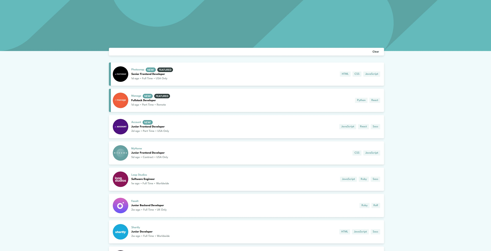

https://frontend-mentor-static-job-listings-react.vercel.app/

# Frontend Mentor - Job listings with filtering solution

This is a solution to the [Job listings with filtering challenge on Frontend Mentor](https://www.frontendmentor.io/challenges/job-listings-with-filtering-ivstIPCt). Frontend Mentor challenges help you improve your coding skills by building realistic projects. 
## The challenge

Users should be able to:

- View the optimal layout for the site depending on their device's screen size
- See hover states for all interactive elements on the page
- Filter job listings based on the categories

### Screenshot

### Built with

- Semantic HTML5 markup
- CSS custom properties
- Flexbox
- CSS Grid
- Mobile-first workflow
- [React](https://reactjs.org/) - JS library

### Links

- Solution URL: [Click here](https://www.frontendmentor.io/solutions/responsive-job-listings-with-filtering-build-with-react-0yMnFl9cyt)
- Live Site URL: [Click here](https://frontend-mentor-static-job-listings-react.vercel.app/)